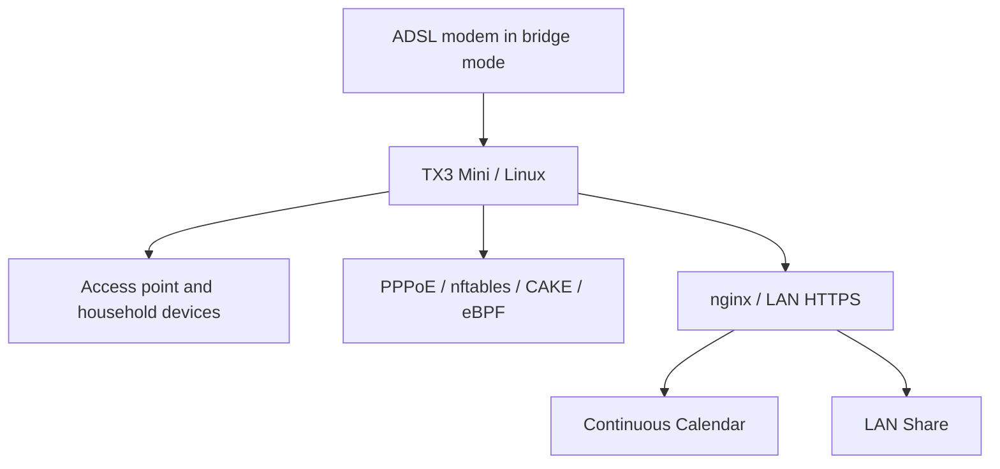

# A small TV box, a household network, and a few useful tools

An Amlogic S905W TX3 Mini grew from an unused Android TV box into a Linux router and home server. The constraint was a roughly 10 Mbps / 500 Kbps ADSL line; the goal was to keep the connection usable while the house was using it.

## AI assistance and feedback

AI generated most of the project-specific code and documentation. I brought the needs, tried things on my own setup, and shared the results to guide the work. I'm still learning, and there may be mistakes or better approaches I haven't discovered. Existing projects and libraries are credited separately.

Suggestions, corrections, alternative solutions, and any helpful notes are welcome. Please [open an issue](https://github.com/Ananas0dev/homelab/issues) or send a pull request—even pointing me toward an existing tool or explaining a better way would help.

| Project | What it does |
| --- | --- |
| [TX3 Home Router](https://github.com/Ananas0dev/tx3-home-router) | PPPoE, CAKE queue management, behavioral eBPF experiments, and the USB Ethernet investigation |
| [Continuous Calendar](https://github.com/Ananas0dev/continuous-calendar) | A self-hosted calendar developed from Evan Wallace's continuous-calendar interface |
| [LAN Share](https://github.com/Ananas0dev/lan-share) | Browser-based text/file sharing and a bounded-memory direct relay |

Each repository keeps implementation and documentation together. Router measurements distinguish historical reports from fresh checks, and experimental configurations are labeled explicitly. Private network identities, credentials, calendar entries, and uploaded files are excluded.
