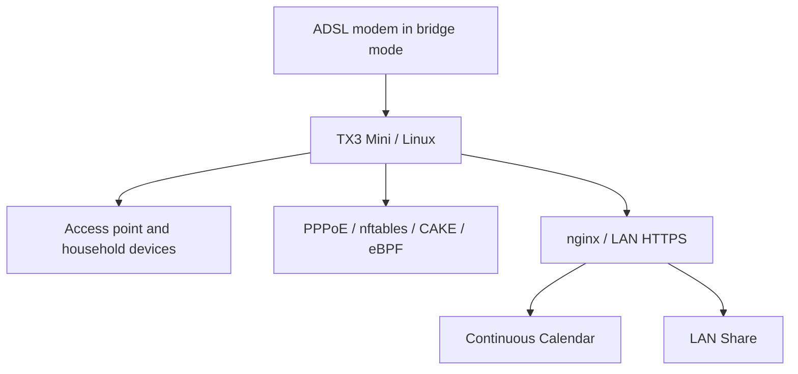

# A small TV box, a household network, and a few useful tools

An Amlogic S905W TX3 Mini grew from an unused Android TV box into a Linux router and home server. The constraint was a roughly 10 Mbps / 500 Kbps ADSL line; the goal was to keep the connection usable while the house was using it.

| Project | What it does |
| --- | --- |
| [TX3 Home Router](https://github.com/Ananas0dev/tx3-home-router) | PPPoE, CAKE queue management, behavioral eBPF experiments, and the USB Ethernet investigation |
| [Continuous Calendar](https://github.com/Ananas0dev/continuous-calendar) | A self-hosted calendar developed from Evan Wallace's continuous-calendar interface |
| [LAN Share](https://github.com/Ananas0dev/lan-share) | Browser-based text/file sharing and a bounded-memory direct relay |

Each repository keeps implementation and documentation together. Router measurements distinguish historical reports from fresh checks, and experimental configurations are labeled explicitly. Private network identities, credentials, calendar entries, and uploaded files are excluded.
